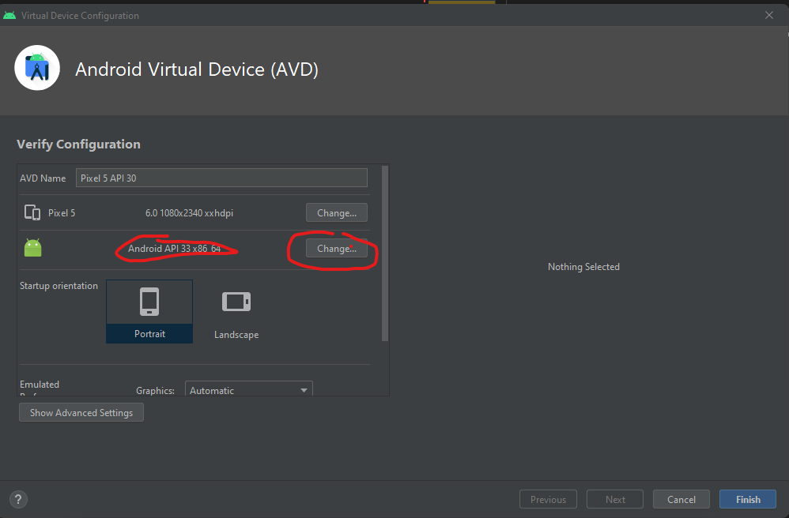

# Croco | Player M3U

Plateforme pour visionner des films à partir d'un fichier .M3U

## Installation

### Prérequis

Ce utilise les dernières fonctionnalité d'Android Studio pour permet la lecture du contenue à partir d'un navigatuer web.

Installer API 33

```bash
Un émulteur avec la dernière API 33
```



Installer les dépendances

```bash
pub get install
```

Ajouter les fichiers de configuration

```bash
cp .env.example .env

# Entrer les informations de la base de données et de TMDB
```
